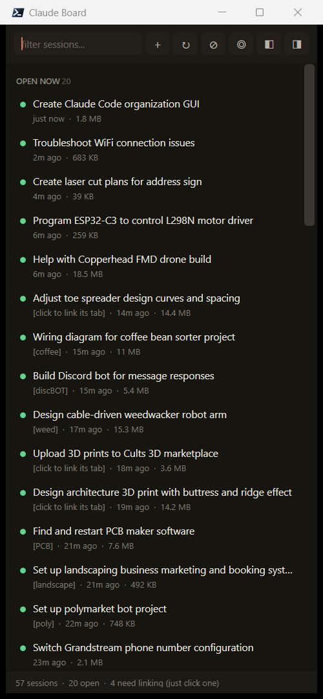

# Claude Board

A sidebar for your [Claude Code](https://claude.com/claude-code) sessions on Windows.

Every session you've ever started, listed by its real title, on one side of the screen.
**Click a running one and Windows Terminal jumps straight to its tab.**



## Why

If you run a lot of Claude Code sessions, the terminal tab bar stops being useful somewhere
around the tenth tab. Titles truncate to two characters, tabs spill across several windows,
and finding "the one about the drone wiring" means clicking through all of them.

Claude Code already writes everything needed to fix this — it just isn't surfaced anywhere.

## What it does

- **Lists every session on disk**, newest first, grouped `PINNED` / `OPEN NOW` / `NOT OPEN`
- **Real titles** — the ones Claude generates for each conversation, not the first line you typed
- **Green dot = running right now**
- **Single click → jumps Windows Terminal to that session's tab**
- **Double click → resumes a closed session** in a new tab, in its original working directory
- **Type to filter** across titles, folders and opening prompts
- **`+`** starts a new session — in the selected session's folder, a recent folder, or one you browse to
- **Remove sessions from the board** without touching the chat, or delete a chat for good
- Dock to either screen edge, pin always-on-top, pin favourite sessions to the top
- Pins, hidden sessions, manual tab links and window geometry persist between runs

Nothing is sent anywhere. It reads your local session files and drives your local terminal.

## Install

Requires Windows 10/11, PowerShell 7 (`pwsh`), and Windows Terminal.

```powershell
git clone https://github.com/loveislife767/claude-board.git
cd claude-board
.\install.ps1
```

That copies the board to `%USERPROFILE%\claude-board`, puts a `cb` command on your PATH, and
creates Desktop + Start Menu shortcuts. Then just run:

```
cb
```

`.\install.ps1 -Startup` also launches it at login. To uninstall, delete the folder, the
shortcuts, and `cb.cmd`.

You can also skip the installer entirely and run `pwsh -sta -File .\ClaudeBoard.ps1`.

## Keys and controls

| | |
|---|---|
| type anything | filter the list |
| click a running session | jump to its terminal tab |
| double-click / `Enter` | resume a closed session in a new tab |
| `Delete` | remove the selected session from the board |
| `Ctrl+F` | jump to the filter box |
| right-click | link to a tab, pin, open folder, copy resume command, close, delete |
| `+` `↻` `⊘` `◎` `◧` `◨` | new · refresh · show hidden · always-on-top · dock left · dock right |

## How it works

Three things make this possible, none of them documented anywhere obvious.

**Session titles are on disk.** Claude Code stores each conversation at
`%USERPROFILE%\.claude\projects\<encoded-cwd>\<session-id>.jsonl`, and writes records like
`{"type":"ai-title","aiTitle":"Wiring diagram for coffee bean sorter"}` into them. The newest
one wins, and it gets rewritten as a conversation drifts, so the board scans both the head and
the tail of each file and caches per last-write-time. Only top-level `*.jsonl` files count —
the `<session-id>\` subfolders are subagent transcripts and aren't resumable.

**Windows Terminal tabs can be driven through UI Automation.** There's no CLI for "focus the
tab named X". But each tab is a `TabItem` in the UIA tree exposing `SelectionItemPattern`, so
`.Select()` switches to it, followed by `SetForegroundWindow` wrapped in the usual
`AttachThreadInput` dance to actually raise the window from another process.

Two traps here. Enumerate **every** Windows Terminal top-level window rather than
`Process.MainWindowHandle` — several WT windows share one process, and on the machine this was
built for that meant 13 of 21 tabs were invisible. And skip windows of class
`PseudoConsoleWindow`: every ConPTY shell owns one, it passes `IsWindowVisible`, and focusing
it does nothing at all.

**Matching a session to its tab is the hard part.** Two cases are exact:

- the tab title equals the session's `aiTitle` — which *also* proves the session is open, and
  is the only way to detect a session started as plain `claude`, since those have no session id
  on any command line for a process scan to find
- a link you set by hand

Everything else is running `claude --resume <id>`, so the id comes straight off the process
command line — but that identifies the *session*, not which tab it's sitting in. If you've
renamed tabs by hand (`landscape`, `discBOT`, `epm?`), those names exist nowhere in Claude's
data, so the board scores tab names against session titles and folder names, camelCase-aware,
and assigns best-first, one tab per session. Exact token match beats prefix beats stem overlap —
`landscaping` doesn't start with `landscape`, so plain prefix matching isn't enough.

Roughly three quarters of hand-renamed tabs match automatically. Anything left over says
`[click to link its tab]`, and clicking it asks which tab it is — once, then it's remembered.
Whatever a session matched to is shown in brackets under its title, so a wrong guess is
obvious rather than mysterious.

## Troubleshooting

```
cb -diagnose
```

Prints every session, every terminal tab, which ones matched, how (`EXACT` / `fuzzy` / `MISS`),
which tabs are unclaimed, and the best score for anything that missed.

## Notes

- Reads `.jsonl` files with `FileShare.ReadWrite` — live sessions hold them open
- Full tab sweeps run every ~30s and on demand; ordinary refreshes only recheck processes
- `board-state.json` sits next to the script and holds pins, hidden ids, links and geometry

## License

MIT
